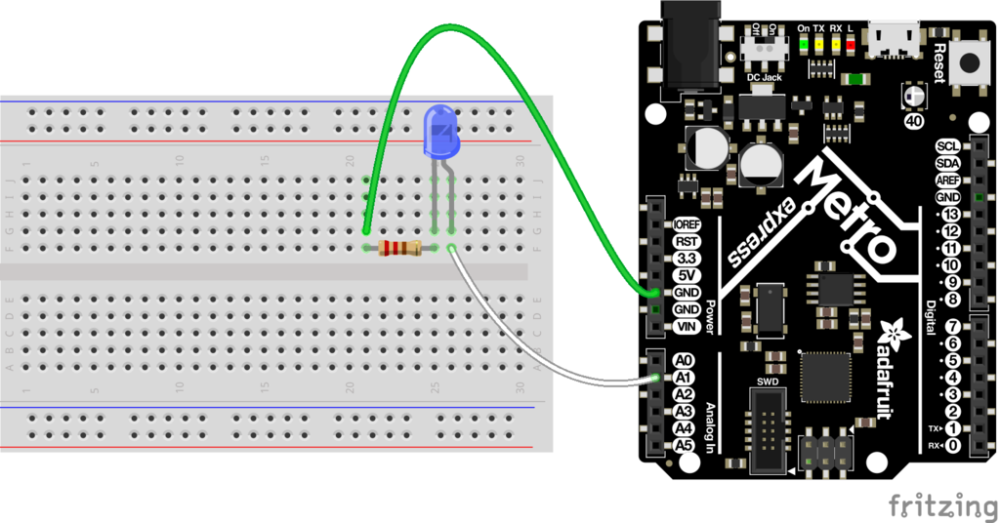

# CircuitPython

# LED Blink

### What I learnned
* I learned how to create a document in MU Editor.
  * To run a document, it must be named either main.py or code.py.
* I learned how to import libraries in Circuit Python
  * You write import and then the library's name at the top of your file.

Link to code: [LED Blink](https://github.com/phalvor47/CircuitPython/blob/main/LED_Blink.py)

Credit: [Fritzing](https://learn.adafruit.com/circuitpython-digital-inputs-and-outputs/digital-outputs)
