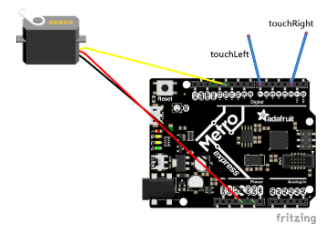
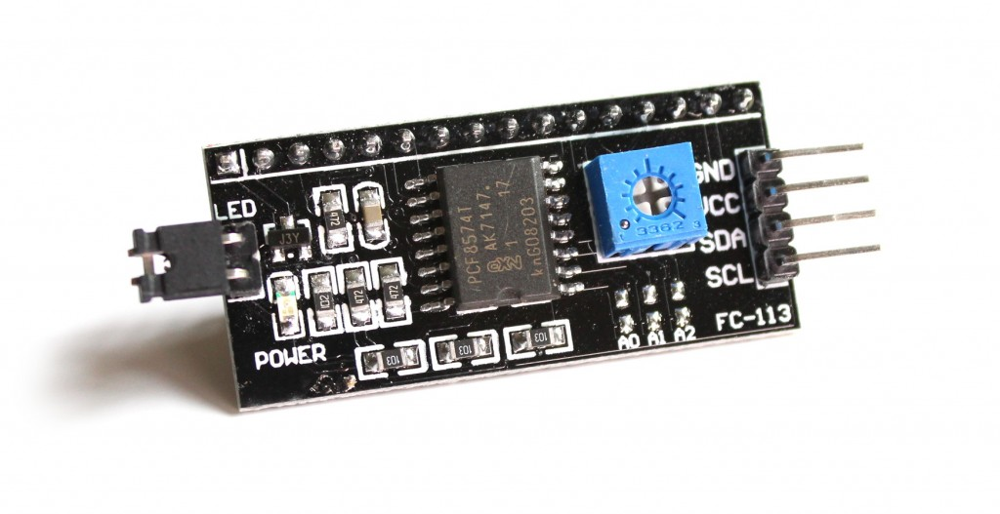
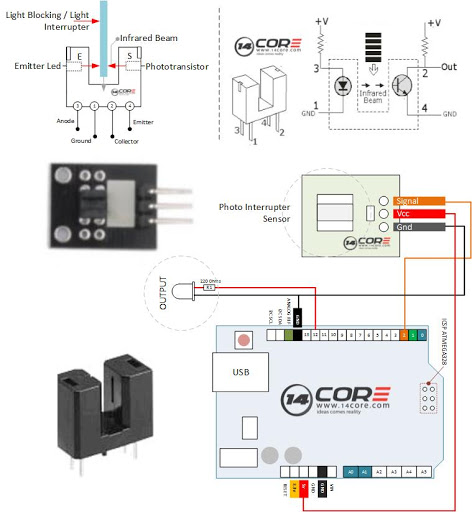
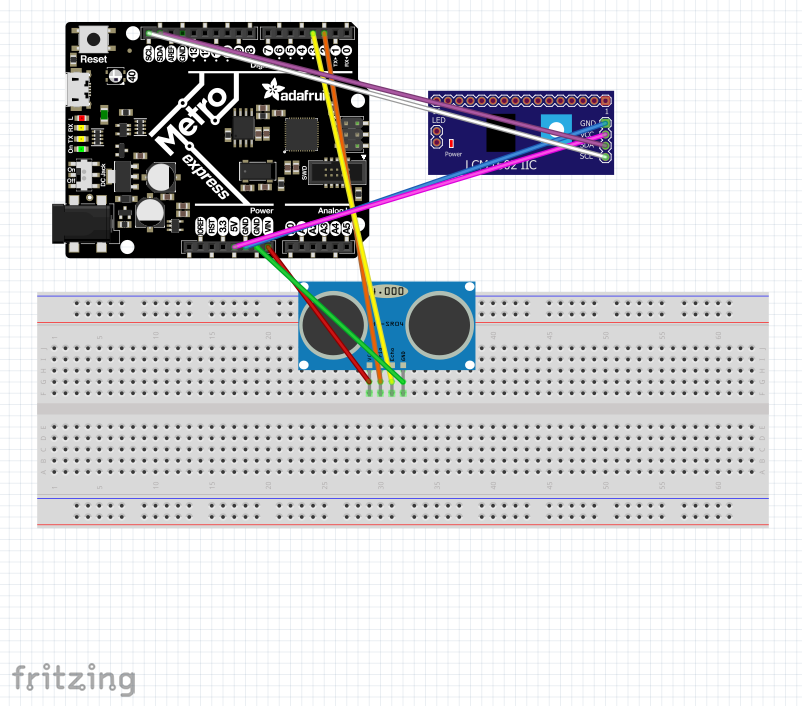
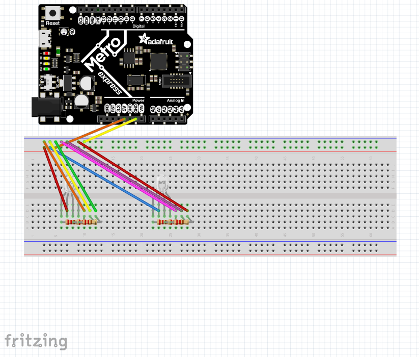

# CircuitPython

# LED Blink

### What I learned
* I learned how to create a document in MU Editor.
	* To run a document, it must be named either main.py or code.py. 
* I learned how to import libraries in Circuit Python
	* You write import and then the library's name at the top of your file.

Credit: [Fritzing](https://learn.adafruit.com/circuitpython-digital-inputs-and-outputs/digital-outputs)

# Servo

### What I learned
* I learned how to troubleshoot with friends.
	* I had never used a PWM pin before so I asked my friend Lucas Fuller for some help. He explained it and I implemented it into my code
* I learned what Capacitive Touch is.
	* Capacitive Touch allow you, in this case, to control a servo with your fingers.

Credit: Dr. Shields

# LCD

### What I learned
* I learned how to use a LCD with CircuitPython.
	* I learned to wire it up and figure out which libraries to use.
* I expanded my knowledge on Capacitive touch.
* I learned how to use the internet to figure out coding problems.

We connected wires to this backpack which connected them to the LCD. This made the process a lot simpler.

Credit: Rasberry Pi Spy

# Photointerrupter

### What I learned
* I learned how to wire up a photointerrupter.
	* The internet helped a lot here since I had never wire one up before. 
* I expanded my knowledge on LCDs.

This image helped me undertand a photointerrupter. Mine has an extra but its connected to the positive pin by one wire.

Credit: 14core.com

# Distance Sensor

### What I learned
* I learned how to use a distance sensor with Circuit Python.
	* My friend Miles helped me with all the problems I had!

Credit: Miles Kershner

# Class, Objects, and Modules

### What I learned
* I learned how to what classes, objects, and modules are in Circuit Python.
        * My friend Miles answered some questions I had as well as helped me on this assignment.
* I expanded my knowledge on LEDs.

Credit: Miles Kershner

